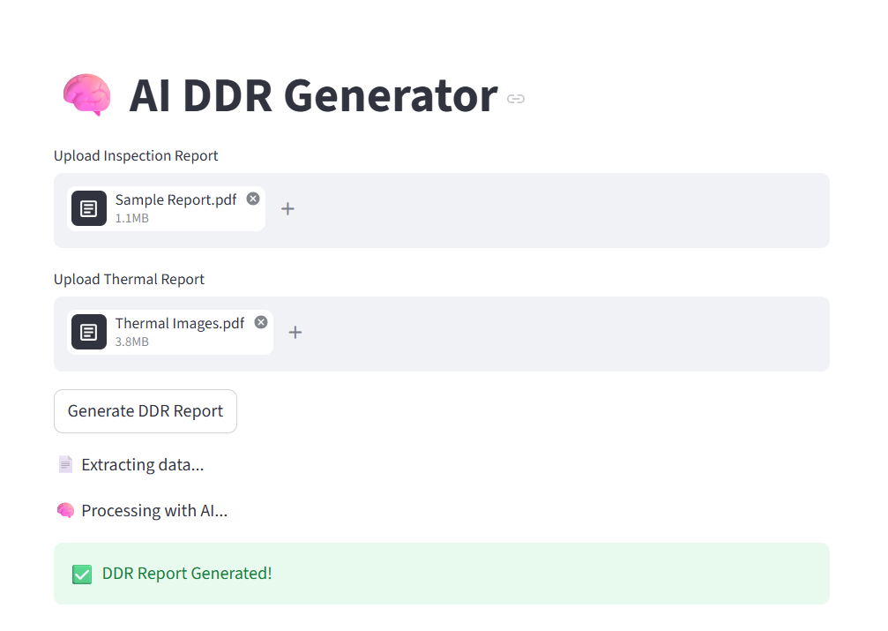
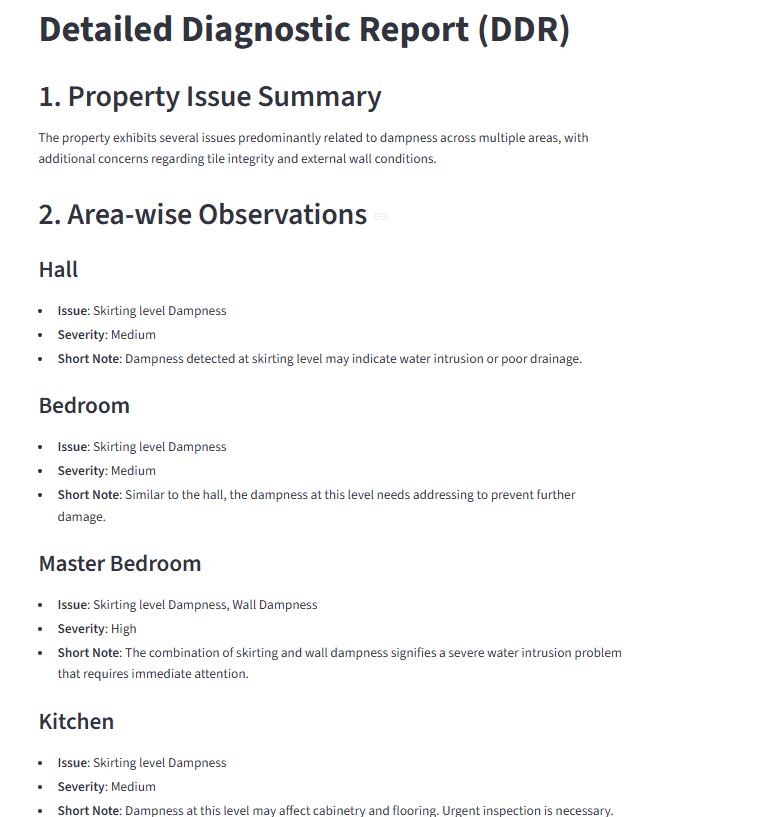
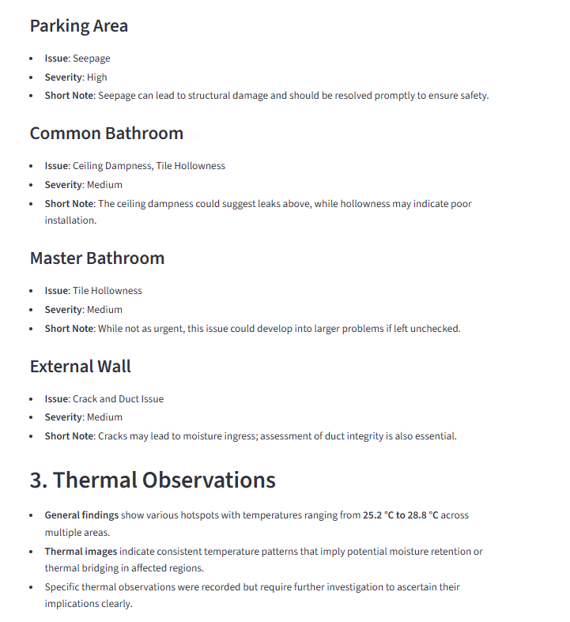
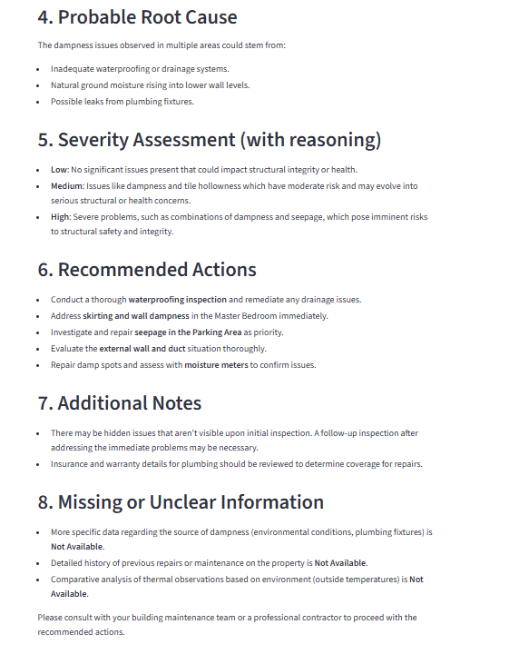

DDR Report Generator

This project is an AI-powered system that converts raw inspection and thermal reports into a structured Detailed Diagnostic Report (DDR).

##  Features
- PDF text and image extraction
- AI-based structured data extraction
- Intelligent merging of inspection and thermal data
- Client-ready report generation

##  Tech Stack
- Python
- Streamlit
- OpenRouter API (LLM)
- PyMuPDF

## ▶ How to Run

```bash
pip install -r requirements.txt
streamlit run app.py


Demo Video
[Loom Video](https://www.loom.com/share/93f54416375c4619b5f0653d383cf4ef)

Screenshots



